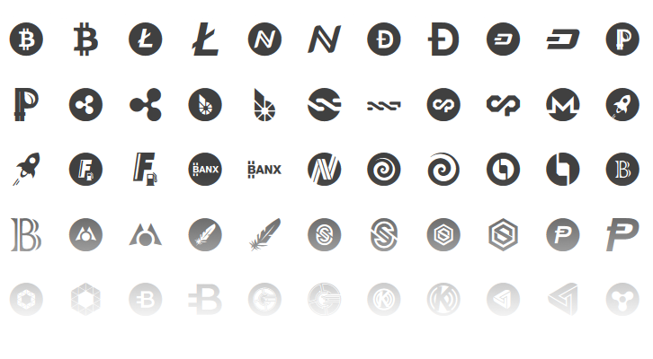

# Cryptocoins

**Cryptocoins is the most complete free vector iconpack of your favourite cryptocurrencies.**

Available in webfont & SVG format for taking advantage of small file sizes and unlimited scalability, Cryptocoins are perfect for usage on the web – right where they belong. Use them all or just the ones you need.

Quick links: **[Demo](https://allienworks.github.io/cryptocoins/icons-demo)** • **[Installation](docs/installation.md)** • [Contributing Guidelines](CONTRIBUTING.md) • [Changelog](docs/changelog.md)

----

## Docs & Demo

* **Demo**: [Overview of all icons](https://allienworks.github.io/cryptocoins/icons-demo) contains simple webfont-based demo
* **Download**: clone or [download ZIP](https://github.com/allienworks/cryptocoins/archive/master.zip) directly from GitHub

## Installation

There are many ways/formats how to use Cryptocoins – read [complete installation guide](docs/installation) if you need any help.

* **[SVG images](https://github.com/allienworks/cryptocoins/wiki/SVG-version)**
* **[Webfont](https://github.com/allienworks/cryptocoins/wiki/Webfont-version)** version
* **[npm package](https://www.npmjs.com/package/cryptocoins-icons)** – `npm i cryptocoins-icons`
* **[jsDelivr CDN](https://www.jsdelivr.com/package/npm/cryptocoins-icons)**

#### 3rd party Packages

Built on/with Cryptocoins, these are maintained by the community. Use at your own risk:

* React compoments – [@kirillshevch/react-cryptocoins](https://github.com/kirillshevch/react-cryptocoins)

## Requesting new icons

Initial release contains just a fraction of Altcoins. If you're missing your coin, please let me know so I can include it in next release. Since there are many requests lately and I can hardly keep up, **I have to ask you to follow these guidelines**:

1. [open a new issue](https://github.com/allienworks/cryptocoins/issues/new) in this repo
2. fill in the template (coin name, ticker symbol, link to official logo etc.)
3. _(optional)_ you can include HEX code of the main color used in coin's branding and bitcointalk thread link (not mandatory, but saves me time)
4. (optional) you can notify me on [@AllienWorks](https://twitter.com/AllienWorks) Twitter (also, helps spreading the word)

**This is all completely voluntary work**, so if you want to support my efforts _or_ speed up the addition of your coin, [please donate](https://allien.work/about.html#donate). Donation addresses are found below (if you don't see your coin, let me know and I'll send the address afterwards).

## For Contributors

Please see [Contributing guidelines](CONTRIBUTING.md) before submitting your PRs, thanks! PRs not following the Guidelines won't be accepted.

## Author

**Martin Allien**

* Website: [allien.work](https://allien.work)
* Keybase/contact: [martin_allien](https://keybase.io/martin_allien)
* Twitter: [@AllienWorks](https://twitter.com/AllienWorks)

> [Tip me crypto](https://allien.work/about.html#donate) and **support further development**!

## Updates

Moved to [Changelog](docs/changelog.md)

## Licence

Released under [The MIT License](LICENCE)
