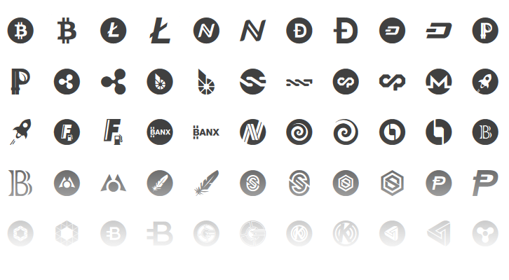

# Cryptocoins

**Cryptocoins is the most complete free vector iconpack of your favourite cryptocurrencies.**

Available in webfont & SVG format for taking advantage of small file sizes and unlimited scalability, Cryptocoins are perfect for usage on the web – right where they belong. Use them all or just the ones you need.

----

## Docs & Demo

* **Demo**:
    - [demo.html](demo.html) file contains simple webfont demo
    - [labs.allienworks.net/icons/cryptocoins](http://labs.allienworks.net/icons/cryptocoins) (out-of-date, but animated, ha!)
* **Download**: clone or [download ZIP](https://github.com/allienworks/cryptocoins/archive/master.zip) directly from GitHub

## Installation

There are many ways/formats how to use Cryptocoins. The fastest and recommended way is via SVG directly. Or use the webfont version if you want to include all icons at once:

* **[via SVG](https://github.com/allienworks/cryptocoins/wiki/SVG-version)** `recommended` – when you need just a few icons in your project
* [Webfont version](https://github.com/allienworks/cryptocoins/wiki/Webfont-version) – ideal when you want to include all icons at once
    - _Pro tip:_ [Learn how to generate icon webfonts](https://allien.work/blog/howto-generate-icon-webfont) – it's even better when you only include those you really need
* NPM package – `npm i cryptocoins-icons`

#### 3rd party Packages

Built on/with Cryptocoins, these are maintained by the community. Use at your own risk:

* React compoments – [@kirillshevch/react-cryptocoins](https://github.com/kirillshevch/react-cryptocoins)

## Requesting new icons

Initial release contains just a fraction of Altcoins. If you're missing your coin, please let me know so I can include it in next release. Since there are many requests lately and I can hardly keep up, **I have to ask you to follow these guidelines**:

1. [open a new issue](https://github.com/allienworks/cryptocoins/issues/new) in this repo
2. fill in the template (coin name, ticker symbol, link to official logo etc.)
3. _(optional)_ you can include HEX code of the main color used in coin's branding and bitcointalk thread link (not mandatory, but saves me time)
4. (optional) you can notify me on [@AllienWorks](https://twitter.com/AllienWorks) Twitter (also, helps spreading the word)

**This is all completely voluntary work**, so if you want to support my efforts _or_ speed up the addition of your coin, [please donate](https://allien.work/donate). Donation addresses are found below (if you don't see your coin, let me know and I'll send the address afterwards).

## Author

**Martin Allien**

* Website: [allien.work](https://allien.work)
* Keybase/contact: [martin_allien](https://keybase.io/martin_allien)
* Twitter: [@AllienWorks](https://twitter.com/AllienWorks)

> [Tip me crypto](https://allien.work/donate) and **support further development**!

## Updates

| Version | Changes |
| :------ | :------ |
| **2.6** | fixed webfonts (again) & added webfont demo file, icons: added Bitcoin Cash (BCC), Decent (DCT), EOS (EOS), Golos (GOLOS), Monaco (MCO), NEO (NEO), OmiseGO (OMG), Particl (PART), Tezos (XTZ) |
| **2.5** | added Basic Attention Token (BAT), IOTA (IOTA), Gnosis (GNO), Radium (RADS) |
| **2.4** | added Gulp task to optimize and check SVGs via Travis CI, published npm package, re-added webfont version |
| **2.3** | added Heat Ledger (HEAT), Iconomi (ICN), Incent (INCNT), Komodo (KMD), Breakout (BRK), Breakout Stake (BRX), PIVX (PIVX), Triggers (TRIG), UBIQ (UBQ), Florincoin (FLO), Golem Network (GNT) + switched to MIT licence |
| **2.2** | removed webfont version, switched to "rolling release", added Ardor (ARDR), AuroraCoin (AUR), Blockfreight (BFT), GameCredits (GAME), Augur (REP), Waves (WAVES), Z-Cash (ZEC); updated Decred (DCR), Neos (NEOS), Stratis (STRAT) |
| **2.1** | updated Peercoin (PPC), added AudioCoin (ADC), Bitsend (BSD), The DAO (DAO), Europecoin (ERC), Ethereum Classic (ETC), Goldcoin (GLD), Groestlcoin (GRS), Kobocoin (KOBO), LBRY (LBC), Pinkcoin (PINK), Reddcoin (RDD), RISE (RISE), Sia (SIA), Salus (SLS), SynergyCoin (SNRG), Steem (STEEM), Stratis (STRAT), BitSwift (SWIFT) |
| **2.0** | tweaked styles for **separate namespace** (see issue #7), fixed Ripple (XRP) typo, added Digitalcoin (GDC), DigixDAO (DGD/DGX), Facton (FCT), Jumbucks (JBS), Lisk (LISK), PiggyCoin (PIGGY), Rubies (RBIES), Sarcoin (SAR), SterlingCoin (SLG), Tether (USDT), Zeitcoin (ZEIT) |
| **1.6** | added Aeon (AEON), Synereo (AMP), Anoncoin (ANC), Bata (BTA), Clams (CLAM), Cloakcoin (CLOAK), Decred (DCR), Neos (NEOS), Gulden (NLG), OKcash (OK), Omni (OMNI), Scotcoin (SCOT), Storj (SJCX), Startcoin (START), Syscoin (SYS), Transfercoin (TX), Vanillacoin (VNL), Verge (XVG), updated Rubycoin (RBY) |
| **1.5** | added DigiByte (DGB), DogeCoinDark (DOGED), EmerCoin (EMC), Ethereum (ETH), MintCoin (MINT), MonaCoin (MONA), MicroCoin (MRC), NeuCoin (NEU), Novacoin (NVC), Rubycoin (RBY), updated BitBay |
| **1.4** | added BitBay (BAY), Diamond (DMD), Franko (FRK), I/O Coin (IOC), LiteDoge (LDOGE), MasterTraderCoin (MTR), Monetary Unit (MUE), Sapience AIFX (XAI), Primecoin (XPM), updated BitStake (XBS) |
| **1.3** | updated Darkcoin → Dash, added Infinitecoin (IFC), Vertcoin (VTC), NEM (XEM), DNotes (NOTE), Rimbit (RBT), GetGems (GEMZ), VeriCoin (VRC), ARCHcoin (ARCH), BitStake (XBS) |
| **1.2.1** | added optional `cryptocoins-colors.css` for **coloring** all icons/coins |
| **1.2** | added Bytecoin (BCN), Gridcoin (GRC), KoreCoin (KORE), MaidSafeCoin (MAID), Quark (QRK), SuperNET (UNITY), Viorcoin (VIOR), VPN coin (VPN) + updated BitShares (BTSX → BTS) |
| **1.1** | added Stellar (STR), FuelCoin (FC2), BanxShares (BANX), NuBits/NuShares (NBT/NSR), BitcoinDark (BTCD), YbCoin (YBC), BlackCoin (BC), Mastercoin (MSC), Feathercoin (FTC), Sync (SYNC), PotCoin (POT), OpalCoin (OPAL), Shadow (SDC) |
| **1.0** | added Bitcoin (BTC), Litecoin (LTC), Namecoin (NMC), Dogecoin (DOGE), Peercoin (PPC), Darkcoin (DRK), Ripple (XRP), Bitshares (BTSX), Counterparty (XCP), NXT (NXT), Monero (XMR) |

## Licence

Released under [The MIT License](LICENCE)
